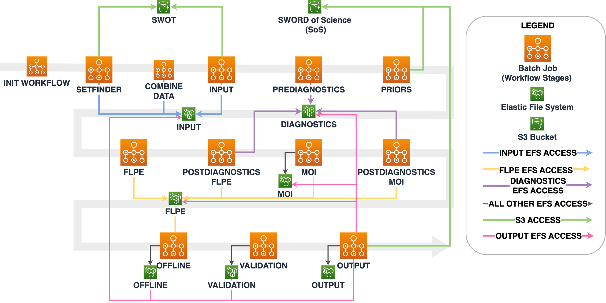

# confluence

## components

Confluence consists of several components
-

## aws infrastructure

### workflow-infrastructure

The Confluence workflow includes the following AWS service in the `workflow-infrastructure` directory
-

### stepfunction-infrastructure

The Confluence workflow includes the following AWS service in the `stepfunction-infrastructure` directory
-

## terraform

Deploys AWS infrastructure and stores state in an S3 backend. This top-level terraform repo contains AWS infrastructure that applies to all components. Each component may have additional terraform files for deploying AWS resources, see each components `README.md` for details.

To deploy:

1. Edit `conf.tfvars` for environment to deploy to.
2. Initialize terraform: `terraform init -reconfigure -backend-config="bucket=confluence-<env>-tf-state" -backend-config="key=confluence.tfstate" -backend-config="region=us-west-2" -backend-config="profile=<named_profile>"`
3. Plan terraform modifications: `terraform plan -var-file="conf.tfvars" -out="tfplan"`
4. Apply terraform modifications: `terraform apply tfplan`

`<env>` can be `dev1`, `dev2`, `dev3` or `ops`
`<named_profile>` is the name of the profile used to authenticate to AWS
